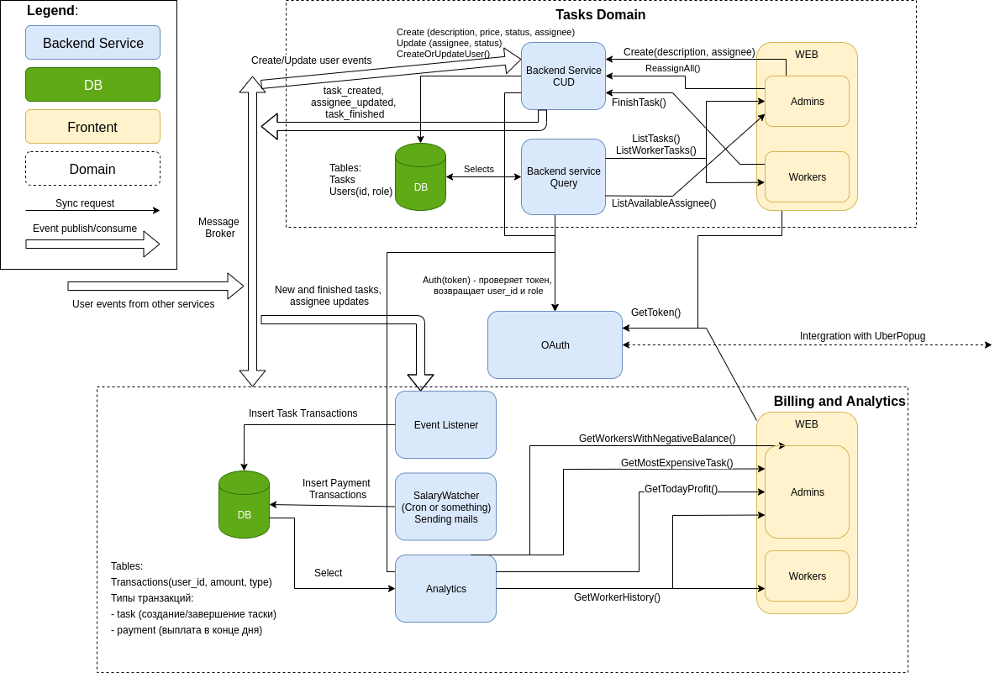

# Awesome Task Exchange System (aTES) для UberPopug Inc
Это учебный проект.

# Схема сервиса

Имеется два домена: **Tasks** и **Billing and Analytics**. 

Первый занимается только созданием и обновлением задач, выдачей списка 
доступных юзеров для assignee, а также получением юзеров из событий. 
При создании и обновлении задач отправляются события в общий message broker.
Сервисы синхронно связаны только с OAuth сервисом.

Второй занимается подсчетом зарплат и аналитикой. Состоит из сервисов
Event Listener (создает транзакции для зачисления/списания средств за задачи),
SalaryWatcher (по крону раз в сутки выплачивает деньги работникам и отправляет
письмо на почты), а также Analytics, который читает базу и выполняет нужные
вычисления.