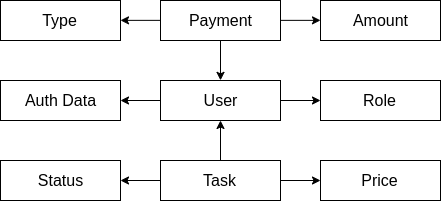
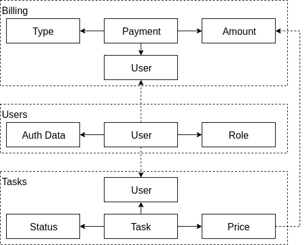
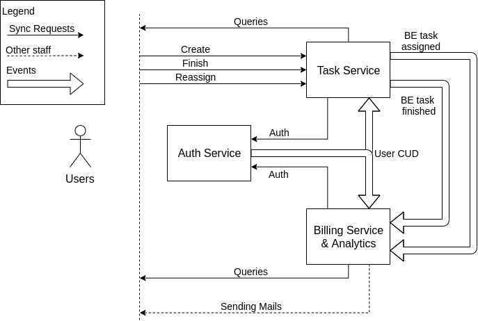

# Awesome Task Exchange System (aTES) для UberPopug Inc
Это учебный проект.

## Разбор требований

Возможные действия в системе:

| Требование | Актор | Команда | Событие | Данные |
| --- | --- | --- | --- | --- |
| Создание таски | Юзер | Create | task.Assigned | Task id, assignee, price |
| Реассигн | Менеджер | Reassign | task.Assigned | Task id, assignee, price |
| Финиш таски | Разработчик | Finish | task.Finished | Task id |
| Зарплата разработчику | Billing service | Salary | - | User id |

## Модель данных

Я выделил в системе три основные модели: 
- User, у которого есть роль и данные для авторизации
- Payment - платеж юзера. Типом платежа может быть обычная выплата за таску 
(может быть отрицательной) или зарплата (всегда положительная)
- Task - назначенная на пользователя задача. Из основных полей статус и стоимость

## Домены

По основным сущностям можно выделить три домена:
- Users - занимается авторизацией и аутентификацией пользователя, связан с внешним
сервисом UberPopug Inc.
- Tasks - создает новые таски, ассигнит, реассигнит их и завершает. Для работы
ему нужны данные о юзерах
- Billing - занимается платежами пользователя. Слушает события создания/
ассигна и завершения тасок. Для работы так же нужны данные о юзерах. Содержит все
данные для аналитики

## Сервисы

Для этой системы получилось составить сервисы по схеме "домен - сервис":
- Task Service - принимает синхронные запросы для создания/завершения/реассигна тасок, 
а также различные Query-запросы: показать таску работнику, показать все открытые 
таски менеджерам и тд.
  - Публикует BE о создании/ассигне и завершении тасок
  - Принимает CUD юзера
- Auth Service - создание и авторизация юзеров. Принимает синхронные запросы на
проверку авторизации от других сервисов
  - Публикует CUD юзера
- Billing & Analytics Service - принимает синхронные Query-запросы: 
показать счет работнику, количество заработанных компанией денег, 
статистику и тд. Все данные для этого у него есть. По крону рассчитывает
и отправляет зарплату юзерам
  - Слушает BE тасок
  - Отправляет почту с зарплатой

Из улучшений можно разнести сервис биллинга и аналитики. Для этого нужно будет
слушать одни и те же события в этих сервисах, или использовать одну БД.
Аналитика будет только читать базу, биллинг - читать и вычислять зарплату,
создавая в базе платежы с соответствующим типом.